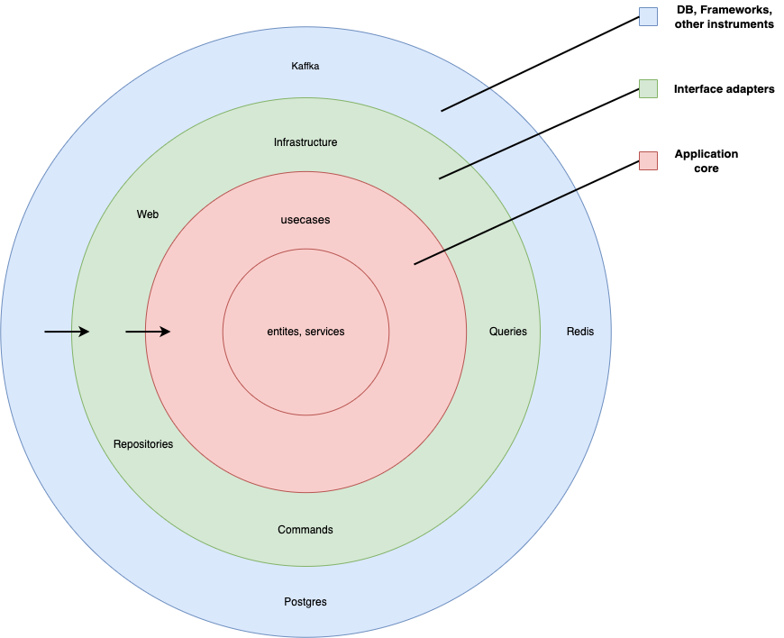

# Шаблон структуры backend приложения

## Архитектура шаблона



## Dependency rule

В шаблоне используется подход [Clean architecture](https://blog.cleancoder.com/uncle-bob/2012/08/13/the-clean-architecture.html).
Для разработки/доработки сервиса нужно понимание чистой архитектуры и правил зависимостей её слоев.

## Использование шаблона
Для использования шаблона понадобится установить cookiecutter [Cookiecutter](https://github.com/cookiecutter/cookiecutter)

Примеры использования:

```zsh
cookiecutter -f https://github.com/audreyr/cookiecutter-pypackage.git
cookiecutter -f git+ssh://git@github.com/audreyr/cookiecutter-pypackage.git
```

Также потребуется использовать poetry для установки зависимостей

##  Стек
Основной стек состоит из:

- FastAPI
- SQLAlchemy
- Alembic
- Dependency-injector
- structlog
- Pydantic
- pytest
- pre-commit
- mypy
- faust

##### Обращаю внимание, что стек может изменяться в зависимости от нужного шаблона

##### В любом проекте обязательно требуется использование pre-commit

```zsh
pre-commit install 
```

Используемые линтеры:

- isort
- black
- autoflake